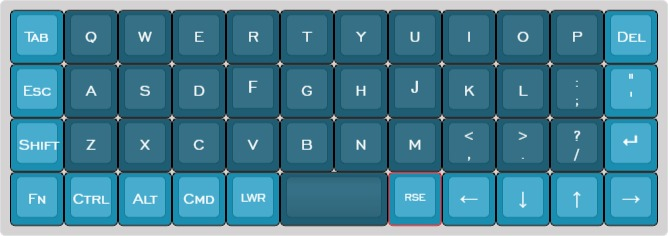

# bm40hsrgb LUMON layouts

 
 

## Base layers

### Qwerty
<pre>
 /*----------------------------------------------------------------------------------.
 | Tab  |   q  |   w  |   e  |   r  |   t  |   y  |   u  |   i  |   o  |   p  | Bksp |
 |------+------+------+------+------+------+------+------+------+------+------+------|
 | Esc~ |   a  |   s  |   d  |   f  |   g  |   h  |   j  |   k  |   l  | ;  : | '  " |
 |------+------+------+------+------+------+------+------+------+------+------+------|
 | Lsft |   z  |   x  |   c  |   v  |   b  |   n  |   m  | , <  |  . > | /  ? | Entr |
 |------+------+------+------+------+------+------+------+------+------+------+------|
 |  Fn  | LCTL | LALT |  GUI |  LWR |    Space    | RSE  | Left | Down |  Up  | Rght |
 `----------------------------------------------------------------------------------*/
</pre>

 

## Momentarily Layers

 ### FN ( Numbers - Symbols - Mail - PGUP/PGDN )
<pre>
 /*----------------------------------------------------------------------------------.
 |   ~  |   !  |   @  |   #  |   $  |   %  |   ^  |   &  |   *  | ([{  |  }]) |  Del |
 |------|------+------+------+------+------+------+------+------+------+------+------|
 |   -  |   1  |   2  |   3  |   4  |   5  |   6  |   7  |   8  |   9  |   0  |   +  |
 |------+------+------+------+------+------+------+------+------+------+------+------|
 | RSFT |NMLOCK|S_SHOT| CALC |MAIL_1|MAIL_2|MAIL_3|MAIL_4|   €  |   ñ  | \  | |   =  |
 |------+------+------+------+------+------+------+------+------+------+------+------|
 |      | RCTL | RALT | RGUI |  LWR |      _      | RSE  | HOME | PGDN | PGUP | END  |
 `----------------------------------------------------------------------------------*/
</pre>
 ### LOWER ( Terminal shotcuts - Mouse )
<pre>
 /*----------------------------------------------------------------------------------.
 |      |      |      |      |      |      |      |      |      |      |MSW UP|      |
 |------+------+------+------+------+------+------+------+------+------+------+------|
 |      |      |      |      |      |      |      |      |      |MSW L |MSW DN|MSW R |
 |------+------+------+------+------+------+------+------+------+------+------+------|
 |      |CTRL+L|CTRL+W|CTRL+Y|      |      |      |      |      | MSBL | MS U | MSBR |
 |------+------+------+------+------+------+------+------+------+------+------+------|
 |      |CTRL+K|CTRLXX|CTRL+U|      |      _      | ADJ  |      | MS L | MS D | MS R |
 `----------------------------------------------------------------------------------*/
</pre>
 ### RAISE ( Media - Function Keys )
<pre> 
 /*----------------------------------------------------------------------------------.
 |      | BRID | BRIU |PRNSCR|PRNSEL| PREV | PLAY | NEXT | MUTE | VOL- | VOL+ |      |
 |------+------+------+------+------+------+------+------+------+------+------+------|
 |      |  F1  |  F2  |  F3  |  F4  |  F5  |  F6  |  F7  |  F8  |  F9  | F 10 |      |
 |------+------+------+------+------+------+------+------+------+------+------+------|
 |      | F 11 |      |      |      |      |      |      |      |      | F 12 |      |
 |------+------+------+------+------+-------------+------+------+------+------+------|
 |      |      |      |      |  ADJ |      _      |      |      |      |      |      |
 `----------------------------------------------------------------------------------*/
</pre>
 ### ADJUST ( RGB Matrix control )
<pre>
 /*----------------------------------------------------------------------------------.
 |      |      |      |      |      |      |      |      |      |      |      |      |
 |------+------+------+------+------+-------------+------+------+------+------+------|
 |      |      | SAT- | SAT+ |      | AMOD | HMAP |      | MOD- | MOD+ |      |      |
 |------+------+------+------+------+------+------+------+------+------+------+------|
 |      |RGBTOG| BRI- | BRI+ |      | UPDN | MNXS |      | SPD- | SPD+ |RGBTOG|      |
 |------+------+------+------+------+------+------+------+------+------+------+------|
 |      |      | HUE- | HUE+ |  LWR |    OSL(5)   | RSE  | MOD- | MOD+ |      |      |
 `----------------------------------------------------------------------------------*/
</pre>
 ### RESET ( Reset Key - Text - Default Layout )
<pre>
 /*----------------------------------------------------------------------------------.
 | RSET |      |      |      |      |      |      |      |TEXT_8|      |TEXT_4|TEXT_0|
 |------+------+------+------+------+------+------+------+------+------+------+------+
 |      |      |      |      |      |      |      |      |      |      |TEXT_5|TEXT_1|
 |------+------+------+------+------+------+------+------+------+------+------+------+
 |      |      |      |      |      |      |      |      |      |      |TEXT_6|TEXT_2|
 |------+------+------+------+------+------+------+------+------+------+------+------+
 |      |      |      |      |      | Q W E R T Y |      |      |      |TEXT_7|TEXT_3|
 `----------------------------------------------------------------------------------*/
</pre>
