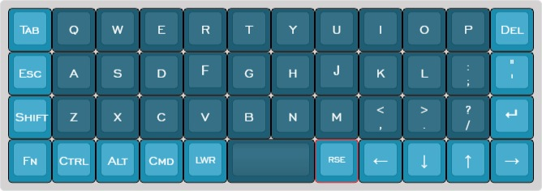

# bm40hsrgb Workmandead layouts

 
 

## Base layers

### Qwerty
<pre>
 /*----------------------------------------------------------------------------------.
 |HYPESC|   Q  |   W  |   E  |   R  |   T  |   Y  |   U  |   I  |   O  |   P  | Bksp |
 |------+------+------+------+------+------+------+------+------+------+------+------|
 | Tab  |   A  |   S  |   D  |   F  |   G  |   H  |   J  |   K  |   L  |   ;  |  "   |
 |------+------+------+------+------+------+------+------+------+------+------+------|
 | LSFT |   Z  |   X  |   C  |   V  |   B  |   N  |   M  |   ,  |   .  |   /  |Enter |
 |------+------+------+------+------+------+------+------+------+------+------+------|
 |  FN  | LCTL | LALT | GUI\ | TT(4)|    Space    | TT(5)| LEFT | DOWN |  UP  | RGHT |
 `----------------------------------------------------------------------------------*/
</pre>
### Workman
<pre>
 /*----------------------------------------------------------------------------------.
 | GUI` |   Q  |   D  |   R  |   W  |   B  |   J  |   F  |   U  |   P  |   ;  |      |
 |------+------+------+------+------+------+------+------+------+------+------+------|
 |      |   A  |   S  |   H  |   T  |   G  |   Y  |   N  |   E  |   O  |   I  |      |
 |------+------+------+------+------+------+------+------+------+------+------+------|
 |      |   Z  |   X  |   M  |   C  |   V  |   K  |   L  |   ,  |   .  |   /  |      |
 |------+------+------+------+------+------+------+------+------+------+------+------|
 |      |      |      |      |      |             |      |      |      |      |      |
 `----------------------------------------------------------------------------------*/
</pre>

 

## Momentarily Layers

 ### LOWER
<pre>
 /*----------------------------------------------------------------------------------.
 |      |      |      |      |      |      |      |      |      |      |      |      |
 |------+------+------+------+------+------+------+------+------+------+------+------|
 |      |      | PREV | PLAY | NEXT |      |      |RGBTOG| BRI+ | BRI- |      |      |
 |------+------+------+------+------+------+------+------+------+------+------+------|
 |      |      | VOL- | MUTE | VOL+ |      |      | MOD+ | HUE+ | HUE- |      |      |
 |------+------+------+------+------+------+------+------+------+------+------+------|
 |      |      |      |      |      |             |      |      |      |      |      |
 `----------------------------------------------------------------------------------*/
</pre>
 ### RAISE
<pre> 
 /*----------------------------------------------------------------------------------.
 |   `  |   %  |   &  |   ?  |   +  |   @  |   $  |   _  |   [  |   ]  |   !  |      |
 |------+------+------+------+------+------+------+------+------+------+------+------|
 |      |   /  |   (  |   =  |   0  |   {  |   }  |   1  |   *  |   )  |   -  |   #  |
 |------+------+------+------+------+------+------+------+------+------+------+------|
 |      |   6  |   7  |   8  |   9  |   |  |   \  |   2  |   3  |   4  |   5  |   ^  |
 |------+------+------+------+------+-------------+------+------+------+------+------|
 |      |      |      |      |      |             |      | SFTL | SFTD | SFTU | SFTR |
 `----------------------------------------------------------------------------------*/
</pre>
 ### ADJUST
<pre>
 /*----------------------------------------------------------------------------------.
 |      |   1  |   2  |   3  |   4  |   5  |   6  |   7  |   8  |   9  |   0  |      |
 |------+------+------+------+------+-------------+------+------+------+------+------|
 |      |  F1  |  F2  |  F3  |  F4  |  F5  |  F6  |  F7  |  F8  |  F9  |  F10 |      |
 |------+------+------+------+------+------+------+------+------+------+------+------|
 |      |  F11 |  F12 |  F13 |  F14 |  F15 |  F16 |  F17 |  F18 |  F19 |  F20 |      |
 |------+------+------+------+------+-------------+------+------+------+------+------|
 |      |      |      |      |      |             |      |      |      |      |      |
 `----------------------------------------------------------------------------------*/
</pre>
 ### FN
<pre>
 /*----------------------------------------------------------------------------------.
 | MOD+ |      |      |      |      |  1   |  2   |  3   |MS CLT|MS CLC|MS CRT| DEL  |
 |------+------+------+------+------+------+------+------+------+------+------+------|
 | BRI+ |      |      |      |      |  4   |  5   |  6   | MSLT | MSUP | MSRT |OSL(6)|
 |------+------+------+------+------+------+------+------+------+------+------+------|
 | BRI- |      |      |      |      |  7   |  8   |  9   |  0   | MSDN |      |      |
 |------+------+------+------+------+------+------+------+------+------+------+------|
 |      |      |      |      |      |             |      |      |      |      |      |
 `----------------------------------------------------------------------------------*/
</pre>
 ### RESET
<pre>
 /*----------------------------------------------------------------------------------.
 | RSET |      |      |      |      |      |      |      |      |      |      |      |
 |------+------+------+------+------+------+------+------+------+------+------+------|
 |      |      |      |      |      |      |      |      |      |      |      |      |
 |------+------+------+------+------+------+------+------+------+------+------+------|
 |      |      |      |      |      |      |      |      |      |      |      |      |
 |------+------+------+------+------+------+------+------+------+------+------+------|
 |      |      |      |      |      |             |      |      |WRKMAN|QWERTY|      |
 `----------------------------------------------------------------------------------*/
</pre>
