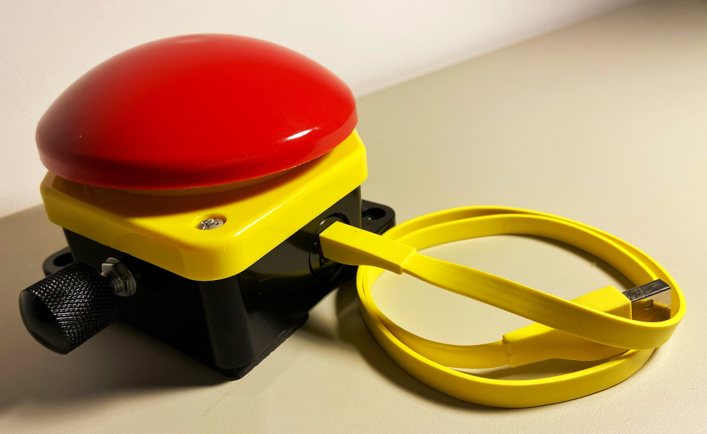

# Double Key Encoder

A macropad with two keys (1 key + 1 rotary encoder)  connected to ProMicro with Atmel-DFU (atmega32u4).

 

 
* Keyboard Maintainer: [QMK Community](https://github.com/qmk)
* Hardware Supported: ATmega32U4

 

To flash this keyboard move **to qmk_firmware** folder and issue the following command:

    make vagabondivan/horus:flash

 

<pre>
HORUS LAYOUT
 .-------+-------.
 | LOCK  |  TAP  |
 |       | DANCE |
 '-------+-------'
